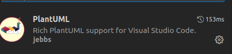
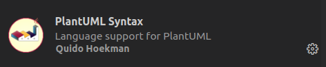
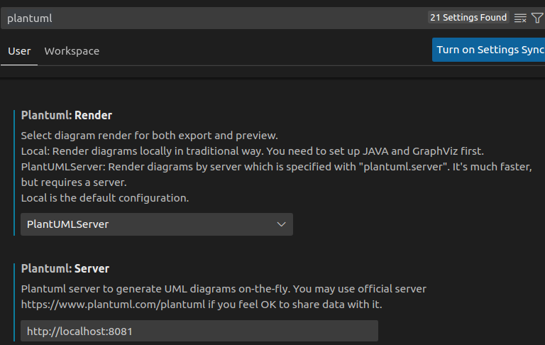
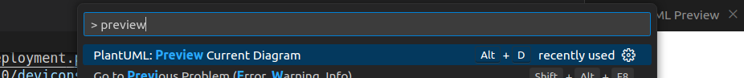
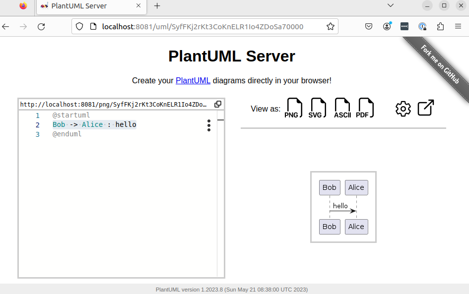
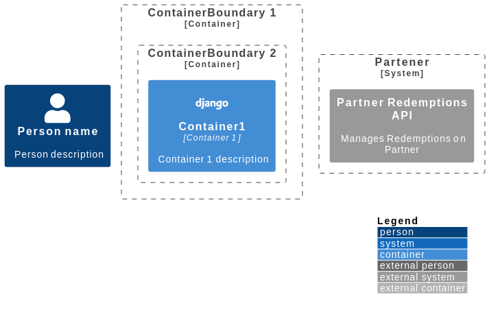
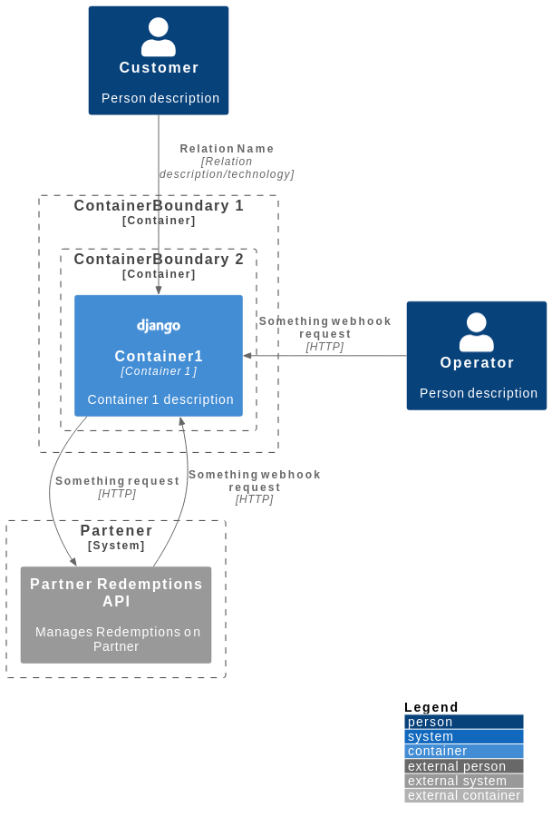

# PlantUML para diagramas do C4

O [PlantUML](https://plantuml.com/) é uma ferramenta **Open Source** para criação de **diagramas** utilizando **código**.

Tem foco nos diagramas da UML, porém, **também suporta outros tipos de diagrama**.


## Por que usar?


---


**Pontos fortes:**

* Linguagem simples e intuitiva
  * Feeling de Markdown - quem usou o [Mermaid](https://mermaid.js.org/) vai ver semelhanças
* Linguagem extensível
  * É possível importar extensões de terceiros ou criar as próprias
* Integração com IDEs
  * Várias IDEs conseguem renderizar os diagramas em tempo real
* Independência da plataforma
  * É possível exportar os diagramas para diversos formatos


**Pontos fracos:**

* Curva de aprendizagem
* Complexidade para grandes sistemas


**Por que manter o diagrama perto do código?**

* **Melhoria na compreensão do código**
  * Facilidade de acessar e associar com o código faz o entendimento ser mais rápido
* **Documentação**
  * Os diagramas passam a fazer parte da documentação do projeto, tanto para pessoas técnicas, quanto para não-técnicas
* **Manutenibilidade**
  * Com os diagramas e documentação na base de código, eles se tornam parte dela - ou seja, ao modificar o código, é mais provável que devs também atualizem os diagramas se eles estiverem juntos
* **Colaboração**
  * Mantendo diagramas e código próximos, devs conseguem usar as mesmas lógicas de colaboração e compartilhamento de informação que já usam


---


## Como usar?


O PlantUML funciona ao submeter o código do diagrama em `plain-text` para um **software ou servidor** e receber uma imagem no formato requisitado como resposta.

No VS-code, é necessário instalar as [extensões](https://github.com/plantuml-stdlib/C4-PlantUML): 






Por padrão, um **servidor de renderização público ** é utilizado. O ideal é rodar esse servidor localmente:

**Via Docker:**

```bash
docker run -d -p 8081:8080 plantuml/plantuml-server:tomcat
```

Detalhes em: https://hub.docker.com/r/plantuml/plantuml-server


**Via `docker-compose`:** https://github.com/plantuml/plantuml-server/blob/master/docker-compose.yml

Instalando o PlantUML como um software: https://plantuml.com/faq-install


Então, é necessário atualizar no VS-Code a referência para qual serviço de renderização usar:


1. Acessar as configs do vs-code com `ctrl+<comma>`

2. Procurar por `plantuml` e alterar o servidor para o endereço do container, e.g `http://localhost:8081`

3. Alterar o `Renderer` para `PlantUMLServer`



Para renderizar:

1. Pressione `ctrl+p` e digite `> preview`. Procure pela opção:




> **Dica:** para validar se a imagem docker está rodando corretamente, é possível abrir uma interface no navegador ao acessar o endereço exposto pelo container. Ex: ao acessar `http://localhost:8081`



---


> **Curiosidade:** é possível fazer um request e receber uma imagem como resposta.  Basta fazer um request `POST` para `/<formato>` enviando o plaint-text do diagrama como payload, via `--data-raw` no curl:
>
> ```bash
> curl 'http://localhost:8081/svg' \
>   -X POST \
>   --data-raw $'@startuml\nBob -> Alice : hello\n@enduml'
> ```
>
> Resposta
>
> ```svg
> <?xml version="1.0" encoding="us-ascii" standalone="no"?><svg xmlns="http://www.w3.org/2000/svg" xmlns:xlink="http://www.w3.org/1999/xlink" contentStyleType="text/css" height="120px" preserveAspectRatio="none" style="width:109px;height:120px;background:#FFFFFF;" version="1.1" viewBox="0 0 109 120" width="109px" zoomAndPan="magnify"><defs/><g><line style="stroke:#181818;stroke-width:0.5;stroke-dasharray:5.0,5.0;" x1="26" x2="26" y1="36.2969" y2="85.4297"/><line style="stroke:#181818;stroke-width:0.5;stroke-dasharray:5.0,5.0;" x1="80" x2="80" y1="36.2969" y2="85.4297"/><rect fill="#E2E2F0" height="30.2969" rx="2.5" ry="2.5" style="stroke:#181818;stroke-width:0.5;" width="42" x="5" y="5"/><text fill="#000000" font-family="sans-serif" font-size="14" lengthAdjust="spacing" textLength="28" x="12" y="24.9951">Bob</text><rect fill="#E2E2F0" height="30.2969" rx="2.5" ry="2.5" style="stroke:#181818;stroke-width:0.5;" width="42" x="5" y="84.4297"/><text fill="#000000" font-family="sans-serif" font-size="14" lengthAdjust="spacing" textLength="28" x="12" y="104.4248">Bob</text><rect fill="#E2E2F0" height="30.2969" rx="2.5" ry="2.5" style="stroke:#181818;stroke-width:0.5;" width="46" x="57" y="5"/><text fill="#000000" font-family="sans-serif" font-size="14" lengthAdjust="spacing" textLength="32" x="64" y="24.9951">Alice</text><rect fill="#E2E2F0" height="30.2969" rx="2.5" ry="2.5" style="stroke:#181818;stroke-width:0.5;" width="46" x="57" y="84.4297"/><text fill="#000000" font-family="sans-serif" font-size="14" lengthAdjust="spacing" textLength="32" x="64" y="104.4248">Alice</text><polygon fill="#181818" points="68,63.4297,78,67.4297,68,71.4297,72,67.4297" style="stroke:#181818;stroke-width:1.0;"/><line style="stroke:#181818;stroke-width:1.0;" x1="26" x2="74" y1="67.4297" y2="67.4297"/><text fill="#000000" font-family="sans-serif" font-size="13" lengthAdjust="spacing" textLength="30" x="33" y="62.3638">hello</text><!--SRC=[SyfFKj2rKt3CoKnELR1Io4ZDoSa70000]--></g></svg>
> ```


---

## Sintaxe

Existe uma extensão para ajudar na criação dos diagramas do C4: https://github.com/plantuml-stdlib/C4-PlantUML.


**Base para um diagrama do C4**

```
@startuml "model"

!include https://raw.githubusercontent.com/plantuml-stdlib/C4-PlantUML/v2.0.1/C4_Deployment.puml
!include https://raw.githubusercontent.com/tupadr3/plantuml-icon-font-sprites/v2.4.0/devicons/django.puml
!include https://raw.githubusercontent.com/tupadr3/plantuml-icon-font-sprites/v2.4.0/devicons/python.puml
!includeurl https://raw.githubusercontent.com/awslabs/aws-icons-for-plantuml/v11.1/dist/AWSCommon.puml

LAYOUT_TOP_DOWN()
LAYOUT_WITH_LEGEND()


@enduml
```


**Bibliotecas:**

* https://plantuml.com/stdlib

* https://github.com/tupadr3/plantuml-icon-font-sprites

* https://github.com/awslabs/aws-icons-for-plantuml


**Usando os componentes**

```
@startuml "model"

!include https://raw.githubusercontent.com/plantuml-stdlib/C4-PlantUML/v2.0.1/C4_Deployment.puml
!include https://raw.githubusercontent.com/tupadr3/plantuml-icon-font-sprites/v2.4.0/devicons/django.puml
!include https://raw.githubusercontent.com/tupadr3/plantuml-icon-font-sprites/v2.4.0/devicons/python.puml
!includeurl https://raw.githubusercontent.com/awslabs/aws-icons-for-plantuml/v11.1/dist/AWSCommon.puml

LAYOUT_TOP_DOWN()
LAYOUT_WITH_LEGEND()

Person(customer, "Person name", "Person description")

Container_Boundary(ContainerBoundaryAlias1, "ContainerBoundary 1") {
    Container_Boundary(ContainerBoundaryAlias2, "ContainerBoundary 2") {
        Container(Container1, "Container1", "Container 1", "Container 1 description", $sprite=django)
    }
}

System_Boundary(ParterBoundary, "Partener") {
    System_Ext(PartnerApi, "Partner Redemptions API", "Manages Redemptions on Partner")
}

@enduml
```




**Criando relações entre componentes**

```
@startuml "model"

!include https://raw.githubusercontent.com/plantuml-stdlib/C4-PlantUML/v2.0.1/C4_Deployment.puml
!include https://raw.githubusercontent.com/tupadr3/plantuml-icon-font-sprites/v2.4.0/devicons/django.puml
!include https://raw.githubusercontent.com/tupadr3/plantuml-icon-font-sprites/v2.4.0/devicons/python.puml
!includeurl https://raw.githubusercontent.com/awslabs/aws-icons-for-plantuml/v11.1/dist/AWSCommon.puml

LAYOUT_TOP_DOWN()
LAYOUT_WITH_LEGEND()

Person(customer, "Customer", "Person description")

Person(operator, "Operator", "Person description")

Container_Boundary(ContainerBoundaryAlias1, "ContainerBoundary 1") {
    Container_Boundary(ContainerBoundaryAlias2, "ContainerBoundary 2") {
        Container(Container1, "Container1", "Container 1", "Container 1 description", $sprite=django)
    }

}

System_Boundary(ParterBoundary, "Partener") {
    System_Ext(PartnerApi, "Partner Redemptions API", "Manages Redemptions on Partner")
}

Rel_D(customer, Container1, "Relation Name", "Relation description/technology")
Rel(Container1, PartnerApi, "Something request", "HTTP")
Rel_U(PartnerApi, Container1, "Something webhook request", "HTTP")
Rel_L(operator, Container1, "Something webhook request", "HTTP")

@enduml
```



---


# C4 diagram

## Abstrações

* Person
  * O usuário humano
* Software System
  * O mais alto nível de abstração de algo que entrega valor aos usuários
* Container
  * Aplicação ou storage de dados
* Component
  * Funcionalidade encpasulada atrás de uma interface
  * Não são entidades "deployaveis" separadamente


# Níveis do C4

## 1. System Context diagram

* A visão macro do sistema
* O sistema a documentar está no centro
* Ao redor dele estão os usuários e sistemas com os quais ele se comunica
* É um diagrama para pessoas não-técnicas, não se apegue aos detalhes


## 2. Container diagram

* Zoom-in no sistema a documentar
* Um container é algo "deployavel"
* Começa a mostrar os componentes internos, mantendo a relação com os externos
* Denota a organização geral da arquitetura e como os containers se comunicam
* Podemos dar detalhes técnicos superficiais


## 3. Component diagram

* Zoom-in em um container
* Mostra os componentes de um container, com mais detalhes de implementação


## 4. Code diagram

* Diagramas como os da UML

